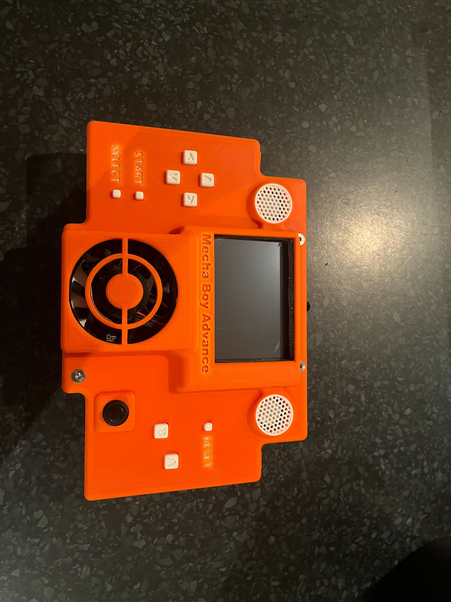
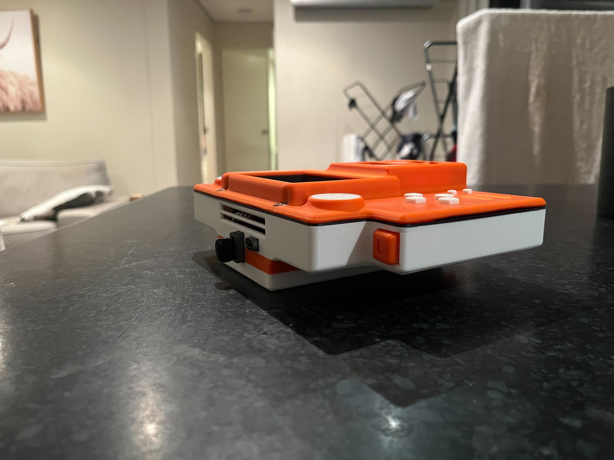
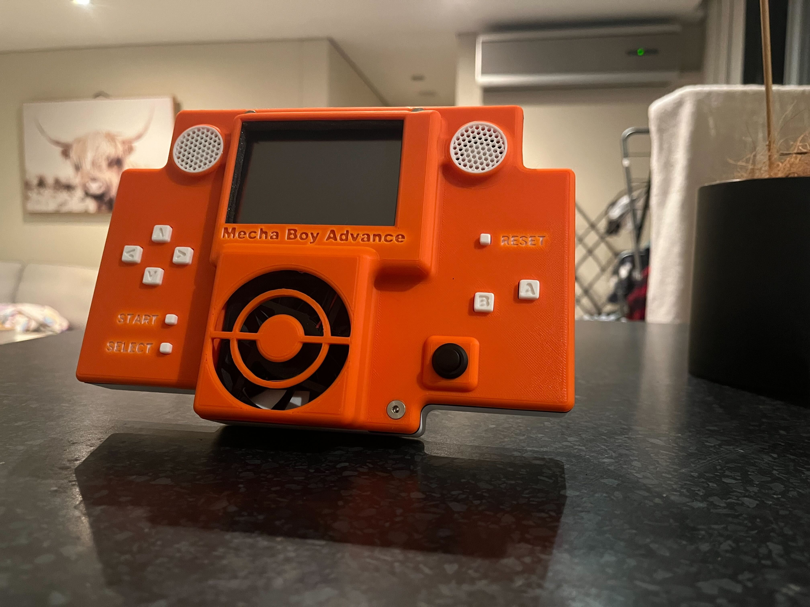
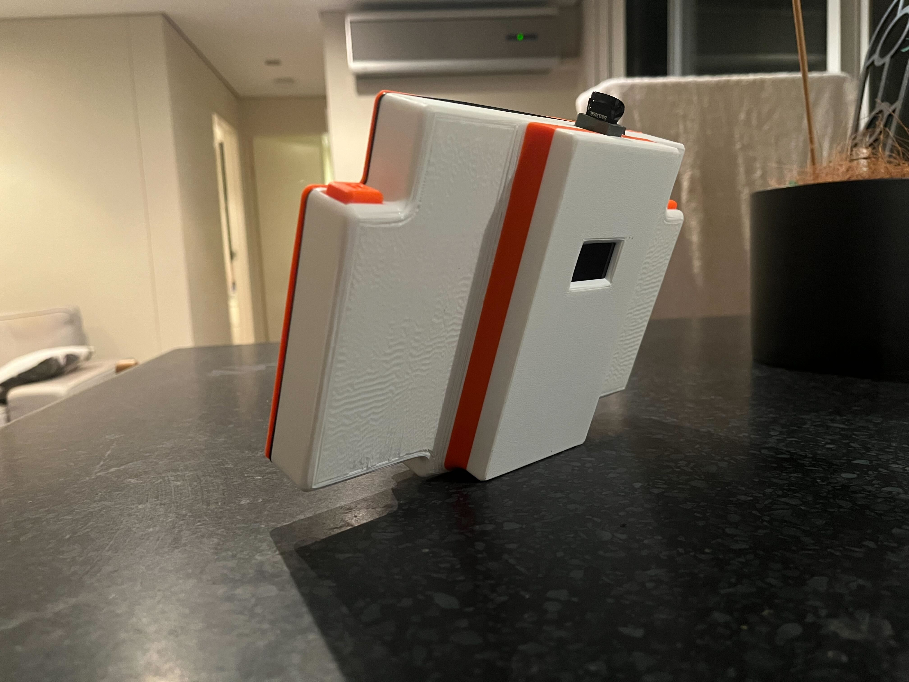
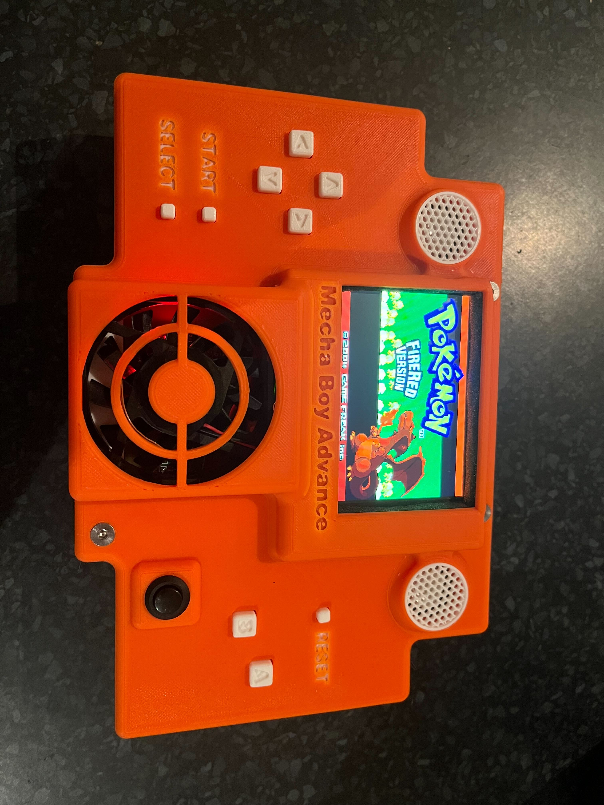
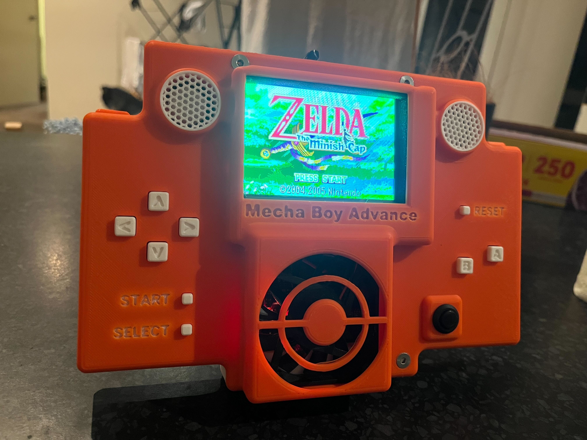

# 🎮 Pi-Based Retro Handheld Console

A fully open-source DIY GBA gaming handheld built around the **Raspberry Pi Zero 2 W**, featuring a custom PCB, 3D-printed enclosure, physical controls, battery power, and a lightweight launcher for running emulators such as mGBA.

> Designed as a gift project - compact, fast-booting, and built to feel like a real handheld console.

---

## ✨ Features

- 🧠 Raspberry Pi Zero 2 W core
- 🎮 Physical buttons with GPIO input
- 🖥️ Dedicated LCD display (SPI)
- 🔋 Battery powered
- 🧱 Custom PCB for controls & power
- 🖨️ Fully 3D-printable enclosure
- ⚡ Fast boot, minimal OS
- 🎯 Lightweight launcher written in C#
- 🕹️ Optimized for GBA via mGBA
- 🛠️ Designed for offline, instant play
- 🔓 Fully open source (hardware + software)

---

## 📸 Photos

---

## 🧰 Hardware Requirements

- Raspberry Pi Zero 2 W
- SPI LCD display (480x320 recommended. I use this one: https://www.waveshare.com/wiki/3.5inch_RPi_LCD_(B))
- Custom PCB (KiCad files included in repo)
- Battery pack + charging module or Power bank that fit in the enclosure (I use this: https://www.amazon.com.au/dp/B0F27LD1S6)
- Tactile buttons
- Speakers (I use these tiny ones: https://www.amazon.com.au/dp/B0DSZWGSS5?th=1)
- PCM5102 DAC
- PAM8403 AMP
- microSD card for OS
- USB storage for ROMs
- 5v Fan
- IRLZ44N Mosfet
- JST XH connectors (The holes spacing on the PCB board is 2.54mm for the connectors)
- Some wires
- Latching push button switch for power (I use this one: https://www.amazon.com.au/dp/B0DCZCT12H)
- Capacitors:
   - 100nF ceramic and 220 µF electrolytic in front of fan power line
   - 100nF ceramic and 220 µF electrolytic in front of DAC power line
   - 100nF ceramic and 470 µF electrolytic in front of AMP power line

---

## 🖨️ Case & Mechanical

- All enclosure parts are 3D printable
- I printed using PLA (other materials may work)
- Assembly uses standard screws

Link to OnShape document is in the "CAD_Models" folder

---

## 🔌 PCB

Custom controller and main board designed in KiCad. All the files are in the "KiCad" folder. I milled them at home using CNC router and 0.5 mm endmill. Holes were drilled using 1 mm drill bit, and the edgecuts were done using 1.5mm endmill. I used single sided FR4 copper clad board.
You can export the gerber file and drill file using KiCad and then use FlatCam to create the gcodes.

---

## 💻 Software

### Launcher

Custom lightweight frontend written in C# and Terminal.Gui library.

Features:

- Controller-only navigation
- ROM browser
- Emulator launching
- Minimal overhead
- Designed for fast boot and responsiveness

---

### Emulator

Primary target:

- **mGBA** for Game Boy Advance

Other emulators may work.

---

## 🚀 Setup

Please read `Setup.md` for complete setup guide for linux.

---

## ⚠️ Power & Shutdown

This device uses a hard power cutoff (no software shutdown button).

To minimize risk of data corruption:
- Avoid powering off during gameplay or saving
- The system flushes important files to disk when you exit the game
- Use high-quality storage media

---

## 🙏 Acknowledgements

- Raspberry Pi Foundation
- mGBA project
- Open-source hardware community
- Everyone who builds cool things just because they can

---

## ⭐ If you build one

Please share photos or videos, I’d love to see it! Also reach out if you need any help.

---

## 📜 License

GNU/GPL v3
https://www.mechabrew.net

---